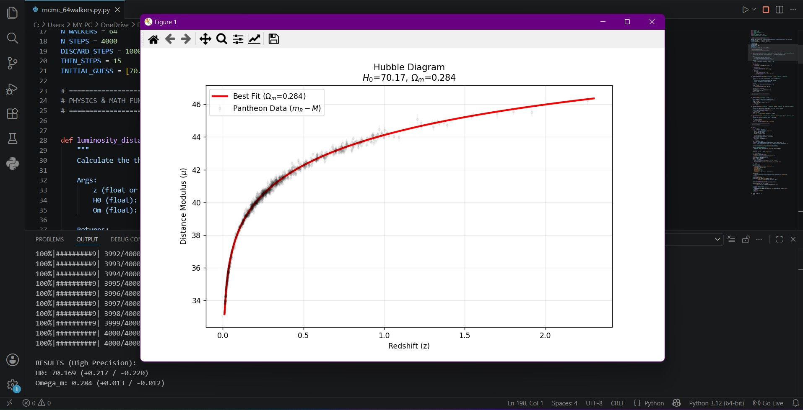
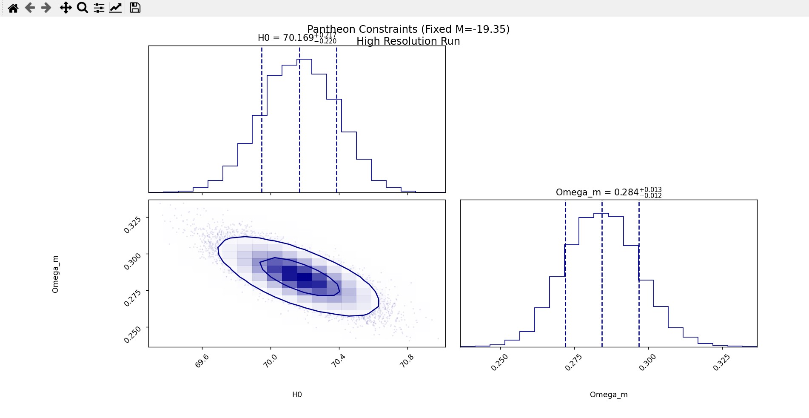

# Pantheon Cosmology MCMC Analysis


## Overview
This project performs parameter estimation for cosmological models using the **Pantheon Type Ia Supernovae dataset**. By fitting theoretical models to observational data, we estimate two fundamental cosmological parameters in a flat $\Lambda$CDM universe:
- **$H_0$** (Hubble Constant): The current rate of expansion of the universe.
- **$\Omega_m$** (Matter Density Parameter): The fraction of the universe's critical density that is in the form of matter.

The code has been written following professional Python standards (Type Hinting, Docstrings, modular structure) to ensure readability and reproducibility.

## Physics Background & Methodology
The project calculates the theoretical **Distance Modulus ($\mu$)** based on the luminosity distance of supernovae at various redshifts ($z$). 
We use **Markov Chain Monte Carlo (MCMC)** simulations to explore the parameter space and find the best-fit values that minimize the difference between theoretical predictions and observational data.

- **Sampling Library:** `emcee` (Affine-invariant ensemble sampler for MCMC)
- **Visualization Library:** `corner` (For posterior probability distributions)
- **Configuration:** 64 Walkers, 4000 Steps (with appropriate burn-in).

## Project Structure
- `mcmc_64walkers.py`: The main Python script containing the standardized MCMC algorithm and cosmological functions.
- `pantheon_dataset.txt`: The input observational dataset (Redshift and Distance Modulus data).
- `hubble_64walkers.jpg`: Plot showing the best-fit theoretical distance modulus curve against the Pantheon observational data.
- `corner_plot_64w.png.jpg`: Corner plot visualizing the marginalized posterior distributions and covariances of $H_0$ and $\Omega_m$.

## Requirements & Installation
To run this project locally, you need Python 3.x. Install the required dependencies using `pip`:
```bash
pip install numpy matplotlib scipy emcee corner

## How to Run
Simply clone the repository and execute the main python script in your terminal:

bash
git clone https://github.com/YOUR_USERNAME/Pantheon-Cosmology-MCMC.git
cd Pantheon-Cosmology-MCMC
python mcmc_64walkers.py
*(Note: Replace `YOUR_USERNAME` with your actual GitHub username).*

## Results & Visualizations
The MCMC analysis successfully converged, yielding the following parameter estimates (with $1\sigma$ uncertainties):
- **$H_0 \approx 70.17$** km/s/Mpc
- **$\Omega_m \approx 0.284$**

### 1. Hubble Diagram
The plot below demonstrates the excellent fit between our theoretical model (red line) and the observational data from the Pantheon dataset.


### 2. Posterior Distributions (Corner Plot)
This contour plot shows the constraints on our cosmological parameters. The tight contours indicate the precise convergence of the 64 walkers during the MCMC sampling.


## License
This project is licensed under the MIT License. Feel free to use, modify, and distribute the code.
